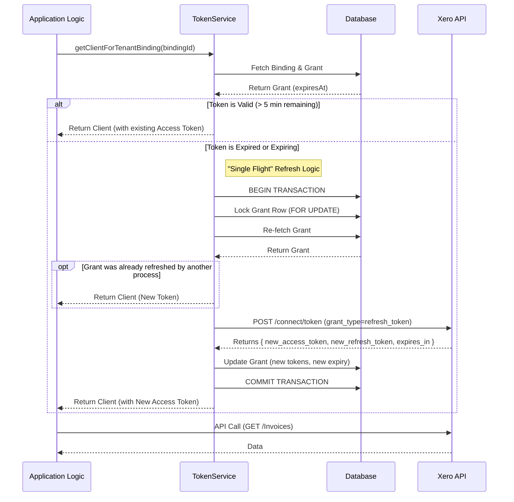

# Xero OAuth2 Token Flow & Implementation

This document details the Xero OAuth2 implementation in the codebase, covering the token lifecycle, exchange, refresh, and rotation strategies. It serves as a guide for developers working with the integration.

## 1. Token Lifecycle Summary

Xero uses standard OAuth2 with short-lived access tokens and rotating refresh tokens.

- **Access Token**: Valid for **30 minutes**. Used to authenticate API requests.
- **Refresh Token**: Valid for **60 days** (unused) or **365 days** (active). It is **Single Use** and **Rotated** on every exchange.
- **Expiry Handling**: The application tracks `expires_in` (seconds) from the token response and calculates an absolute `expiresAt` timestamp in the database.

## 2. Implementation Overview

The implementation is split across three main files:

*   **`app/api/xero/callback/route.ts`**: Handles the initial OAuth callback and code exchange.
*   **`lib/integrations/xero/adapter.ts`**: Contains the low-level Xero API interactions (exchange, refresh, fetch).
*   **`lib/integrations/token-service.ts`**: Manages token storage, retrieval, concurrency (locking), and automatic "Just-In-Time" (JIT) refreshing.

### How to Exchange Authorization Codes

When a user approves the connection on Xero, they are redirected to the callback route.

1.  **Validation**: The state parameter is validated (checking nonce, timestamp, and user identity) to prevent CSRF and Ensure the user authorizing is the same as the one initiating.
2.  **Exchange**: `XeroAdapter.exchangeCode(code)` calls the Xero `connect/token` endpoint.
3.  **Storage**: The resulting `access_token` and `refresh_token` are encrypted and stored in the `integration_grants` table. `expiresAt` is calculated (usually `now + 30 mins`).

### How to Refresh Access Tokens & Handle Rotation

We do **not** use a background cron job to keep tokens alive. Instead, we use a **Just-In-Time (JIT)** strategy.

1.  **Trigger**: When `TokenService.getClientForTenantBinding` is called (e.g., to sync data or fetch a report).
2.  **Check**: The service checks if the current token is expired or will expire within the **5-minute buffer**.
3.  **Locking**: If a refresh is needed, it enters a database transaction with **Row Locking** (`.for("update")`) on the grant row. This prevents race conditions if multiple requests happen simultaneously.
4.  **Refresh**:
    *   It re-checks expiry inside the lock (in case another process just finished refreshing).
    *   Calls `XeroAdapter.refreshTokens(currentRefreshToken)`.
5.  **Rotation**:
    *   Xero returns a **new** `refresh_token` alongside the new `access_token`.
    *   The database is updated with *both* new tokens.
    *   The old refresh token is effectively invalidated by Xero.

### Scopes

The current implementation requests the following scopes (`XeroAdapter.getAuthUrl`):

| Scope | Purpose | Status |
| :--- | :--- | :--- |
| `offline_access` | **Required.** Allows retrieving refresh tokens for long-term access. | ✅ Essential |
| `accounting.transactions` | Read/Write Invoices, Bank Transactions, etc. | ✅ Core |
| `accounting.reports.read` | Read Balance Sheet, P&L, etc. | ✅ Core |
| `accounting.settings` | Read Org details, Tax Rates, Currencies. | ✅ Core |
| `accounting.contacts` | Read/Write Contacts. | ✅ Core |
| `accounting.attachments` | Read/Write file attachments. | ⚠️ Future use |
| `assets.read` | Fixed Assets. | ⚠️ Future use |

**Review:** The requested scopes are appropriate for a comprehensive accounting integration. They cover the necessary permissions for syncing financial data and reports. `offline_access` is correctly included to enable the background/JIT sync capability.

## 3. Sequence Diagram (JIT Refresh Flow)

This diagram illustrates the flow when the application requests a Xero client. It handles the "Happy Path" (valid token) and the "Refresh Path" (expired token) transparently.

